# OPENJOYN CIRCULAR - Construction Catalog

## Introduction

Our motivation for the OPENJOYN project is to explore methods of designing and building digital and analog constructions in the future. To do this, we have developed a bespoke language based on JavaScript to parametrically define and customize wood constructions, such as furniture.

In this repository, a first comprehensive catalogue of constructions can be found.

## Our Main Goal

Our vision is to enable common citizens to build individualized wood constructions. In addition to timeless products such as tables and cabinets, current socially relevant constructions can also get integrated. OPENJOYN is intended to develop into a construction catalog for the globally connected society and can achieve a high impact via a potentially large number of users.

By now everyone can access the construction catalog with a work-in-progress web tool we are hosting using the OPENJOYN JavaScript toolkit!

It can be found here: 

[http://openjoyn.milz.studio](http://openjoyn.milz.studio/)

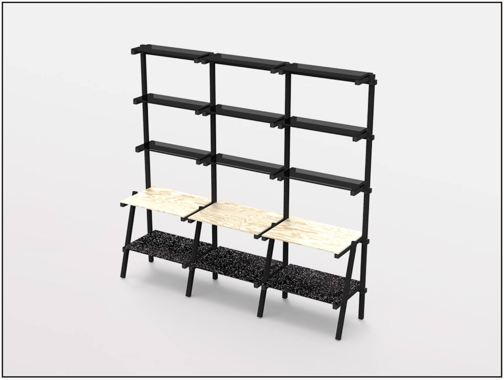

## The catalog 

In this chapter we have listed an overview of the parametric constructions:

### Bank Circular
This design for a bench allows for the integration of existing slats. To promote circular resource use, you can use wood or slats and beams from other materials available. These slats don't need to have a square cross section; the tool allows you to enter the length of the slats and the different side lengths (A and B). These will be marked with color for easy tracking.

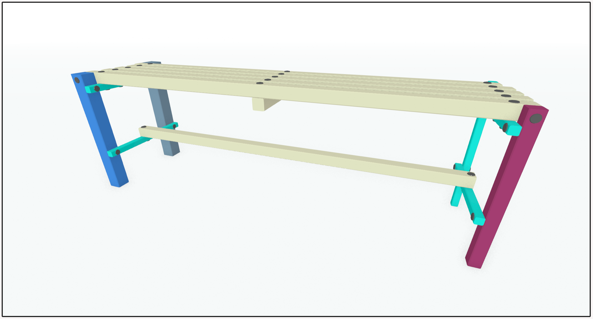

### Beistelltisch Hohes-C
This design is a small table that can be placed next to a couch or bed. Thanks to the C-construction, it can be draped over a bed and used for a bed-breakfast with croissants and freshly squeezed juice.

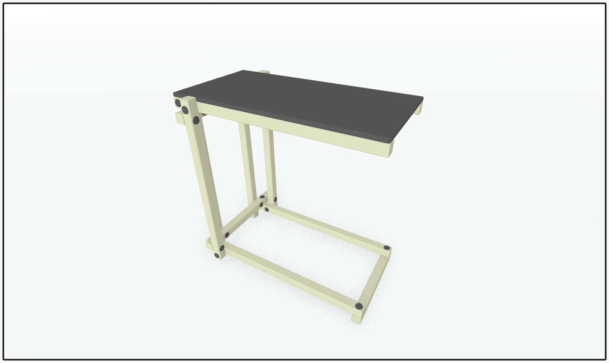

### Garderobe Change
This wardrobe is securely attached to the wall and offers two shelves, for shoes or other items. The upper shelf can also be used as a seating area, making the piece of furniture highly versatile. The lower shoe shelf must be raised to the height of any existing wall skirting board, so that the wardrobe can be pushed up against the wall at the installation site without the skirting board getting in the way.

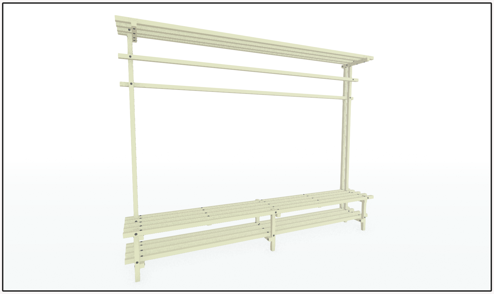

### Couchtisch Little Japan
Japan is a variable coffee table with a vertical construction for the couch and sushi, sashimi, ramen, miso soup, gyoza, yakitori, tempura, and okonomiyaki.

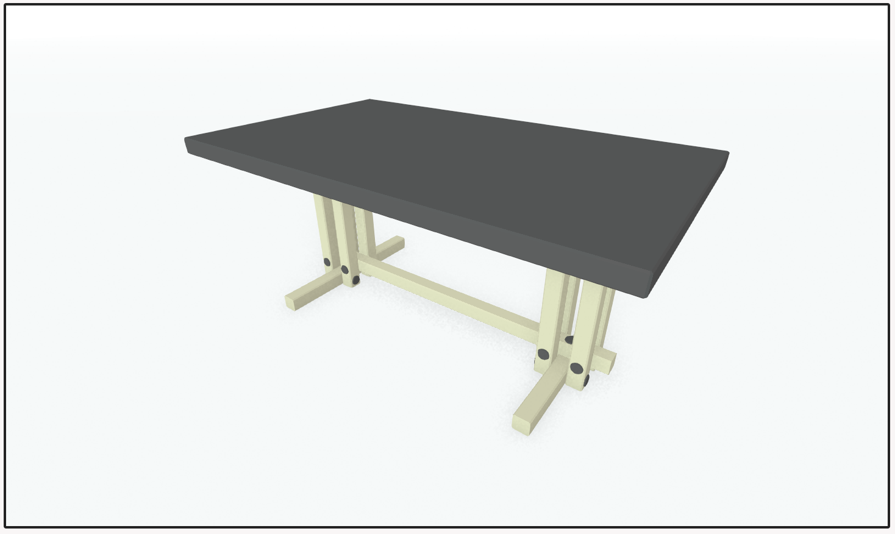

### Bank Seat Sheet
This design is a classic bench for up to four people. It can be quickly assembled and realized with many types of wood. The same design as Bank Kartesi, but with a plate as a seat surface.

### Esstisch ChopChop
ChopChop is a versatile dining table with a vertical design for sushi, sashimi, ramen, miso soup, gyoza, yakitori, tempura, and okonomiyaki.

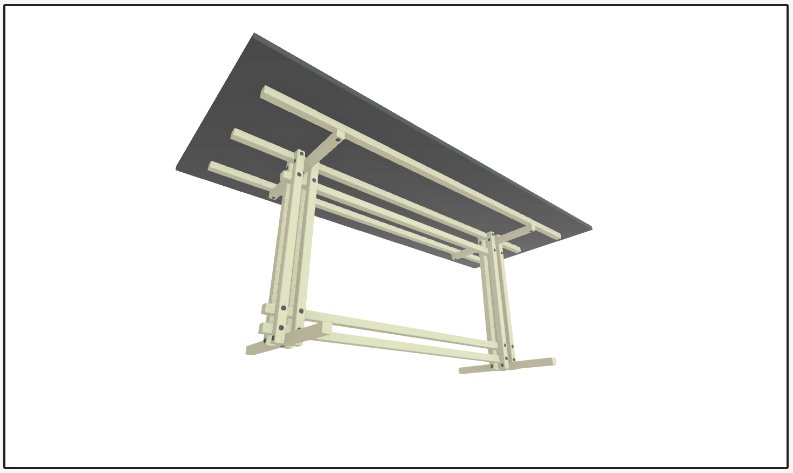

### Garderobe Float
This wardrobe is securely attached to the wall.

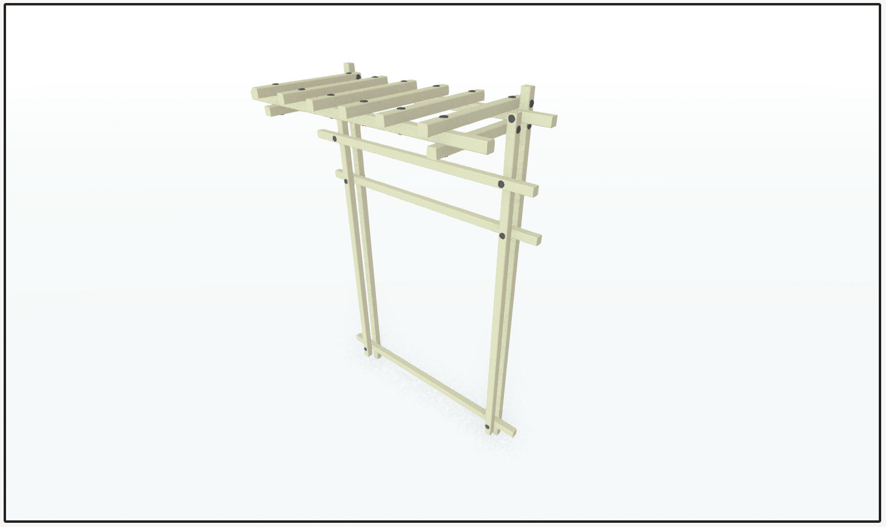

### Regal Self Shelf
A modular shelf design that can be customized to individual needs. Note that it must be securely attached to the wall with dowels, and cannot be set up freestanding.

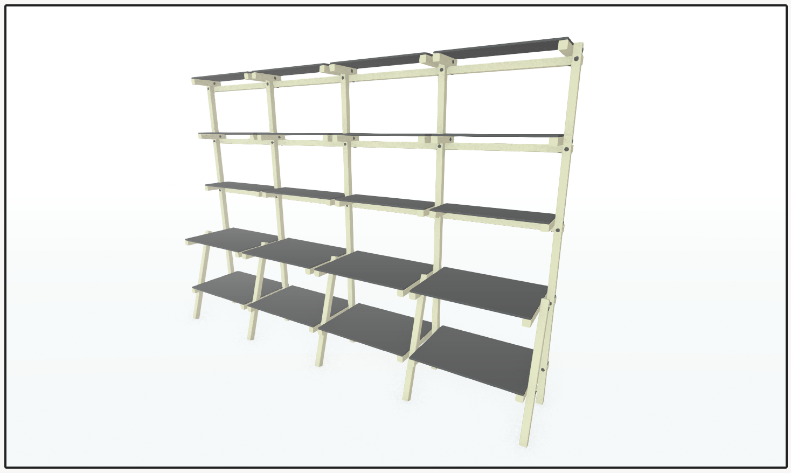

### Schlafbank Nap
This bank can be used for sitting, but its primary purpose is to provide a comfortable sleeping area for a quick nap in the office. It can be outfitted with a tatami mat and/or a roll futon, for example.

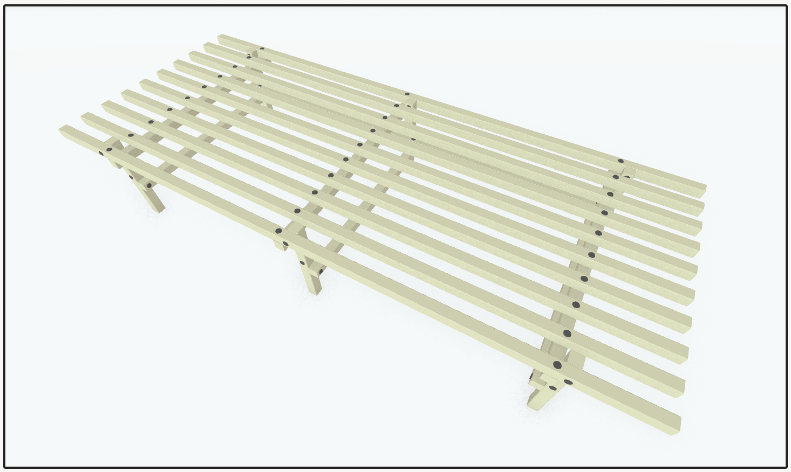

### Couchtisch Superfici
This design features two surfaces that can be made of various materials such as marble, glass, or wood. The thickness of the plates can be specified separately. With its wide range of dimensions, this design can be used in a living room in a variety of ways and doesn't have to be placed in front of a couch.

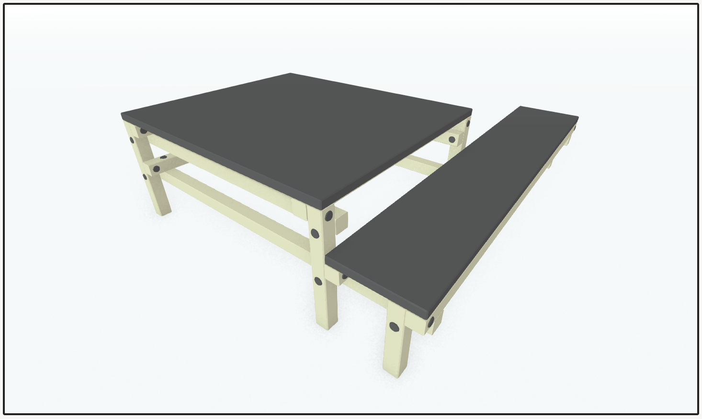

### Schreibtisch One
A simple work table with an adjustable feature.
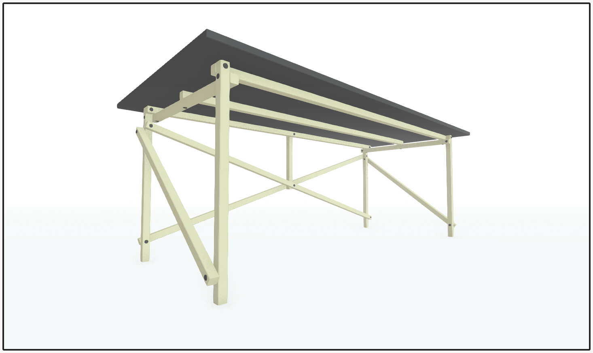

### Bank Kartesi
This classic bench design can seat up to four people. It can be quickly set up and constructed with various types of wood. The size of the gaps between the seat slats has a major impact on seating comfort. If the gaps are larger than 30mm, cushions should be added. If a fiddle slat is used for the construction, the bench remains surprisingly lightweight and mobile.

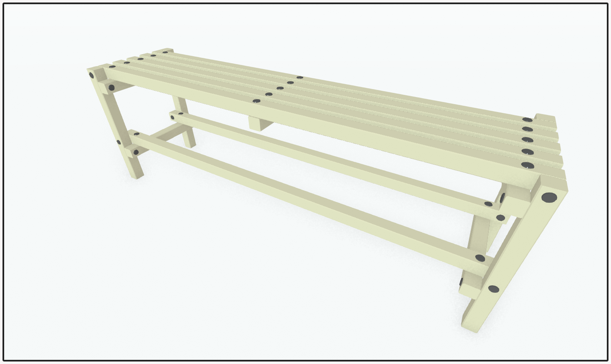

## License

The OPENJOYN source code is released under the AGPL 3.0

## Special Thanks

Thanks to Prototype Fund & DLR (Deutsches Zentrum für Luft- und Raumfahrt).
Special thanks to [allesblinkt](https://allesblinkt.com/) for supporting the project and its idea! A big shout out to all the other individuals who are involved and thanks for their support!

## Funding

The project was funded by the German Federal Ministry of Education and Research under grant number 01IS22S02 from March to August 2022. The authors are responsible for the content of this publication.

[https://openjoyn.milz.studio](https://openjoyn.milz.studio/)
